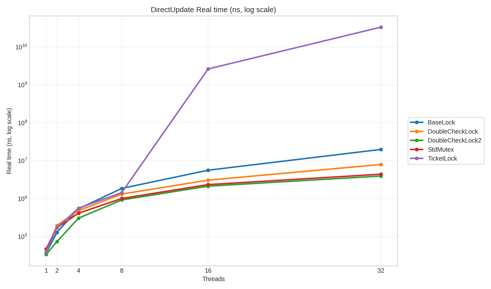
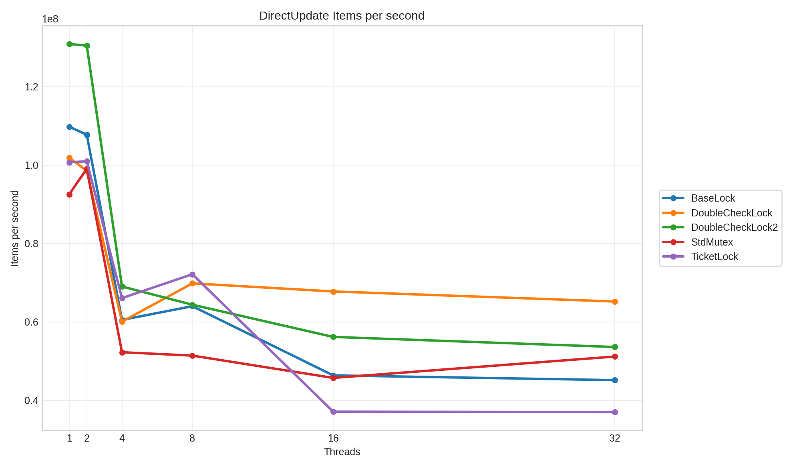
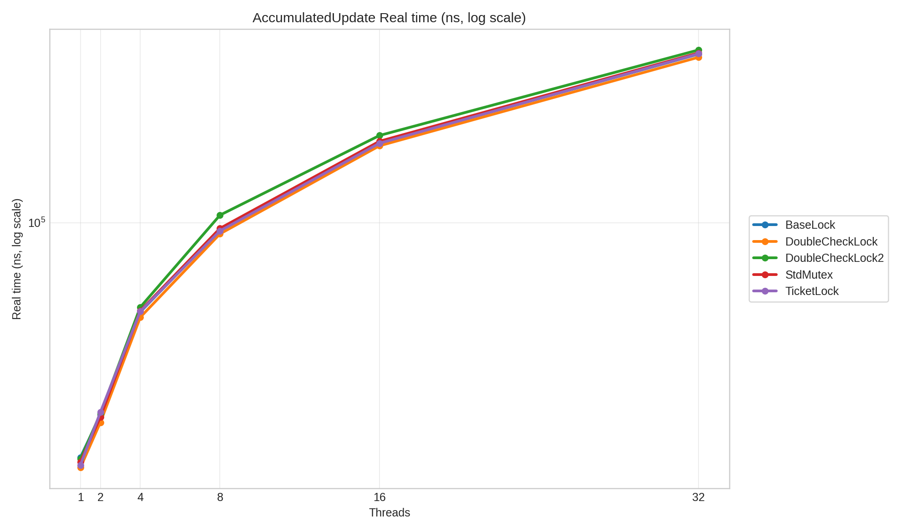
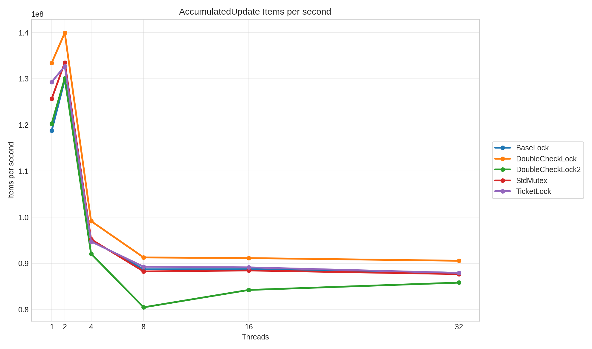

# Spinlock Benchmarking

[](https://github.com/v1bh475u/spinlock_benchmarking/actions/workflows/ci.yml)
[](https://github.com/v1bh475u/spinlock_benchmarking/actions/workflows/benchmark.yml)
[](https://github.com/v1bh475u/spinlock_benchmarking/actions/workflows/codeql.yml)

This repository compares simple C++ spinlock implementations against `std::mutex`
under two contention patterns. Google Benchmark drives the measurement suite, CTest
checks lock correctness, and the Python tooling generates CSV, Markdown summaries,
and PNG graphs from benchmark JSON.

## Implementations

The lock implementations live in `include/spinlock.hpp`.

| Lock | Summary |
| --- | --- |
| `concurrency::base_lock` | Minimal compare-and-swap spin loop. |
| `concurrency::ticket_lock` | FIFO ticket lock with fairness under contention. |
| `concurrency::double_check_lock` | Test-test-and-set style lock to reduce write traffic while waiting. |
| `concurrency::double_check_lock2` | TTAS lock with `cpu_relax()` and exponential backoff. |
| `std::mutex` | Standard library reference implementation used by the benchmark suite. |

## Benchmark Scenarios

| Scenario | Contention pattern |
| --- | --- |
| `DirectUpdate` | Every thread locks, increments the shared counter, and unlocks on each iteration. |
| `AccumulatedUpdate` | Each thread accumulates locally and locks once to publish its local total. |

Each scenario runs at 1, 2, 4, 8, 16, and 32 threads for every implementation.

The benchmark executable is configured from a single lock registry in
`src/benchmark.cpp`:

```cpp
#define LOCK_BENCHMARKS(X) \
  X(concurrency::base_lock, "BaseLock") \
  X(concurrency::ticket_lock, "TicketLock") \
  X(concurrency::double_check_lock, "DoubleCheckLock") \
  X(concurrency::double_check_lock2, "DoubleCheckLock2") \
  X(std::mutex, "StdMutex")
```

To add another lock, implement a type with `lock()` and `unlock()`, then add one
line to `LOCK_BENCHMARKS`. The benchmark suite, JSON output, CSV report, Markdown
summary, and plot generation discover the new lock from the benchmark names.

## Linux Prerequisites

Install the build, test, and graphing dependencies on the Linux machine that will
produce the benchmark results:

```bash
sudo apt-get update
sudo apt-get install -y cmake ninja-build g++ git python3 python3-pip
python3 -m pip install -r scripts/requirements.txt
```

Google Benchmark is fetched automatically by CMake through `FetchContent`.
The Python scripts use Python 3.10 or newer.

## Build And Test

```bash
cmake -S . -B build-release -G Ninja -DCMAKE_BUILD_TYPE=Release
cmake --build build-release --parallel
ctest --test-dir build-release --output-on-failure
```

The build produces:

| Binary | Purpose |
| --- | --- |
| `build-release/spinlock_test` | Multi-threaded correctness test registered with CTest. |
| `build-release/spinlock_bench` | Google Benchmark executable. |

## Run Benchmarks

The recommended path is to use the Python runner so every run captures the same
artifacts and machine metadata:

```bash
python3 scripts/run_benchmarks.py \
  --build-dir build-release \
  --out-dir benchmark-results \
  --build-type Release \
  --cxx g++ \
  --repetitions 10 \
  --min-time 0.5s
```

This writes:

| File | Description |
| --- | --- |
| `benchmark-results/benchmark.json` | Google Benchmark JSON output. |
| `benchmark-results/benchmark.txt` | Human-readable benchmark output. |
| `benchmark-results/metadata.json` | Git commit, kernel, CPU, compiler, CMake, and run settings. |

To run a subset:

```bash
python3 scripts/run_benchmarks.py \
  --benchmark-filter 'DirectUpdate_.*' \
  --repetitions 15 \
  --min-time 1s
```

## Generate Graphs And Reports

Generate CSV, Markdown, and PNG plots from a benchmark JSON file:

```bash
python3 scripts/generate_report.py \
  benchmark-results/benchmark.json \
  --out-dir benchmark-results/report
```

Generated report outputs:

| File | Description |
| --- | --- |
| `benchmark-results/report/benchmark.csv` | Normalized mean results for each scenario, lock, and thread count. |
| `benchmark-results/report/summary.md` | Markdown report with machine metadata, fastest-lock tables, and embedded plot links. |
| `benchmark-results/report/plots/directupdate_real_time_ns.png` | Direct update latency graph. |
| `benchmark-results/report/plots/directupdate_items_per_second.png` | Direct update throughput graph. |
| `benchmark-results/report/plots/accumulatedupdate_real_time_ns.png` | Accumulated update latency graph. |
| `benchmark-results/report/plots/accumulatedupdate_items_per_second.png` | Accumulated update throughput graph. |

Open `benchmark-results/report/summary.md` after generation to view the tables and
graphs together. The plots are multi-line charts: x-axis is thread count, y-axis
is either real time or throughput, and each colored line is one lock type.

## Benchmarking Checklist

Use a quiet Linux host for meaningful numbers. Shared GitHub-hosted runners are
useful for regression smoke tests, but they are not stable enough for authoritative
performance claims.

Recommended local procedure:

```bash
git clean -xfd build-release benchmark-results
cmake -S . -B build-release -G Ninja -DCMAKE_BUILD_TYPE=Release
cmake --build build-release --parallel
ctest --test-dir build-release --output-on-failure
python3 scripts/run_benchmarks.py --skip-build --build-dir build-release --repetitions 15 --min-time 1s
python3 scripts/generate_report.py benchmark-results/benchmark.json --out-dir benchmark-results/report
```

For cleaner measurements:

- Close unrelated CPU-heavy applications.
- Prefer a plugged-in machine with stable cooling.
- Record the CPU governor and kernel in `metadata.json`.
- Run multiple benchmark passes and compare trends, not single-run outliers.
- Treat `DirectUpdate` as the high-contention stress case and `AccumulatedUpdate`
  as the low-contention baseline.

## GitHub Actions

| Workflow | Trigger | Purpose |
| --- | --- | --- |
| `CI` | Push, pull request, manual | Ubuntu builds with GCC and Clang in Debug and Release, CTest, sanitizer tests, and clang-format checks. |
| `Benchmarks` | Manual, weekly schedule | Runs the Linux benchmark suite, generates CSV/Markdown/PNG reports, and uploads artifacts. |
| `CodeQL` | Push, pull request, weekly schedule, manual | Runs GitHub CodeQL analysis for C++. |
| `Release` | Version tag `v*`, manual | Builds Release binaries on Ubuntu, runs tests, packages Linux artifacts, and creates a GitHub release. |

## Manual Google Benchmark Commands

List benchmarks:

```bash
./build-release/spinlock_bench --benchmark_list_tests
```

Run the full suite directly:

```bash
./build-release/spinlock_bench
```

Write JSON directly:

```bash
./build-release/spinlock_bench \
  --benchmark_repetitions=10 \
  --benchmark_report_aggregates_only=true \
  --benchmark_time_unit=ns \
  --benchmark_out=benchmark-results/benchmark.json \
  --benchmark_out_format=json
```

## Repository Layout

```text
.github/workflows/        GitHub Actions CI, benchmark, CodeQL, and release workflows
include/spinlock.hpp      Lock implementations
scripts/run_benchmarks.py Build, test, run benchmarks, and capture metadata
scripts/generate_report.py Convert benchmark JSON into CSV, Markdown, and PNG plots
src/benchmark.cpp         Google Benchmark suite
src/test.cpp              Correctness test registered with CTest
CMakeLists.txt            CMake build configuration
```

## Benchmark Results

### Machine Specs

See [`metadata.json`](docs/benchmarks/linux-local/metadata.json).

### Graphs









Full report: [`summary.md`](docs/benchmarks/linux-local/summary.md)

